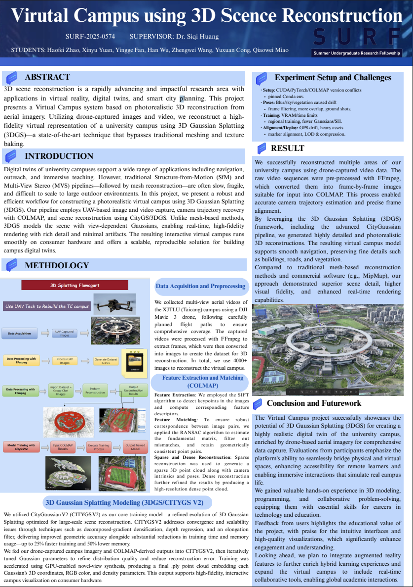
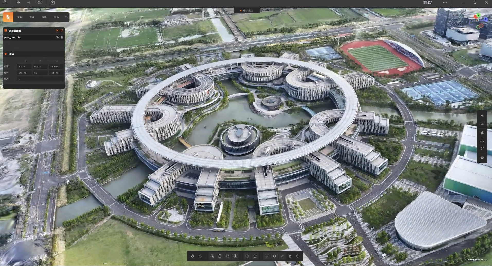
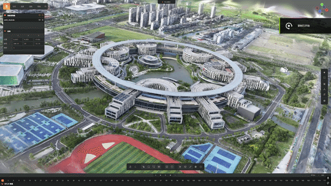

# Virtual Campus Reconstruction using 3D Gaussian Splatting

**Project for Summer Undergraduate Research Fellowship (SURF) | Jul 2025 - Aug 2025**

[//]: 
> **Abstract**: This project presents a robust workflow for constructing a photorealistic virtual campus using 3D Gaussian Splatting (3DGS) and drone-captured imagery. By leveraging CityGaussianV2, we bypass traditional meshing limitations, enabling high-fidelity rendering and immersive navigation on consumer hardware.

---

### Project Overview
The goal of this project was to create a **Digital Twin** of the XJTLU Taicang campus. Traditional 3D reconstruction methods (SfM + MVS) are often slow and fragile for large outdoor scenes. We adopted **3D Gaussian Splatting (3DGS)** to achieve real-time, high-fidelity rendering with rich details.

**Key Features:**
- **Aerial Data Acquisition**: DJI Mavic 3 drone for comprehensive coverage.
- **State-of-the-Art Pipeline**: COLMAP + CityGaussianV2.
- **Efficiency**: 25% faster training and 50% lower memory usage compared to baseline methods.

---

### Technical Methodology

#### 1. Data Acquisition & Preprocessing
- **Hardware**: DJI Mavic 3 drone.
- **Workflow**: 
  - Captured aerial videos following planned flight paths.
  - Used **FFmpeg** to extract over **4,000 high-quality images** from videos.
  - Frame filtering to remove blur and ensure dataset quality.

#### 2. Feature Extraction & Matching (COLMAP)
- **SIFT Algorithm**: Detected keypoints and computed feature descriptors.
- **RANSAC Algorithm**: Estimated fundamental matrix to filter mismatches and retain geometrically consistent points.
- **Reconstruction**: Generated sparse point clouds and camera poses, followed by dense point cloud refinement.

#### 3. 3D Gaussian Splatting (CityGaussianV2)
We utilized **CityGaussianV2**, an advanced 3DGS model optimized for large-scale scenes.
- **Solved Issues**: Addressed convergence and scalability problems.
- **Key Techniques**:
  - Decomposed-gradient densification.
  - Depth regression.
  - Elongation filter.
- **Result**: Produced a final `.ply` point cloud file embedding 3D coordinates, RGB color, and density parameters.

---

### Challenges & Solutions

| Challenge | Solution |
| :--- | :--- |
| **Environment Conflicts** (CUDA/PyTorch) | Pinned Conda environment versions for stability. |
| **Pose Drift** (Blur/Sky/Vegetation) | Implemented frame filtering, increased image overlap, and added ground shots. |
| **Training Bottlenecks** (VRAM/Time) | Applied regional training strategies and optimized Gaussian/SH counts. |
| **Deployment** (GPS Drift/Heavy Assets) | Used marker alignment and LOD (Level of Detail) compression. |

---

### Results & Impact

- **Visual Fidelity**: Superior detail preservation compared to traditional mesh-based methods.
- **Performance**: Smooth real-time rendering on standard consumer hardware.
- **Application**: Enables immersive campus navigation, virtual tours, and supports smart city planning use cases.

[//]: Result Demo

---

### Full Poster
For more detailed technical specifications and experiment data, please refer to the full project poster:
- **[View Project Poster (PDF)](poster.pdf)**